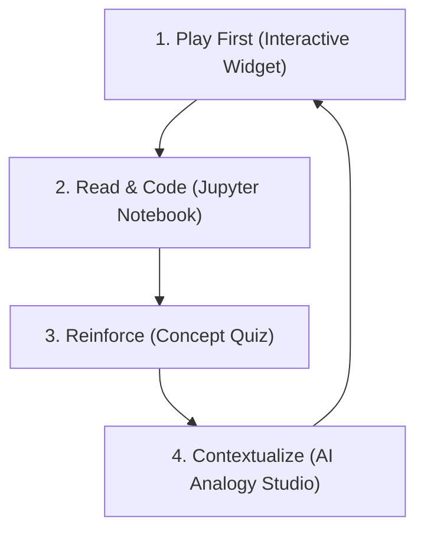

# Educational Methodology

Most quantum computing courses introduce concepts via static presentation slides, list formulas, and then ask students to complete multiple-choice recall quizzes. This methodology fails to build functional development skills and leaves learners feeling overwhelmed.

**Quantum Ascent** implements a four-stage, student-centric pedagogical loop that ensures deep conceptual understanding and active coding skills:

---

---

## 1. Play First, Formalize Second (Intuition Sandbox)
* **The Problem:** Abstract mathematical notations (like Dirac braket notation $|\psi\rangle = \alpha|0\rangle + \beta|1\rangle$) create immediate cognitive friction.
* **The Method:** Every basecamp begins with a lightweight, browser-based widget. Before reading formulas, students interact with sliders, buttons, and visual graphs (e.g., tilting a vector on the Bloch sphere and seeing histograms build up).
* **Direct Visual Intuition:** We ground mathematical abstractions into literal visual ratios. For example, rather than an abstract line pointing on a Bloch sphere, the vector stick itself becomes a physical pie chart—divided into exact green/orange color proportions to match the underlying probability amplitudes of the quantum state.
* **The Result:** The student builds a visual, concrete mental model of physical behaviors (e.g., rotation, probability density, and statistical fluctuations) *before* the formal math is introduced. The math then simply names what the student has already seen and controlled.

## 2. Gap-Fill Active Coding (Rigorous Notebooks)
* **The Problem:** Learners often copy-paste entire blocks of code without understanding the underlying mechanics, leading to passive learning.
* **The Method:** We adopt a "gap-fill" programming structure (inspired by QWorld's QNickel). Notebooks provide the engineering structure, and students are required to write the specific mathematical or logical expressions (e.g., normalizing state coefficients, applying rotations, or constructing cost operators).
* **The Result:** Active recall and problem-solving are triggered. 
* **Statistical Checkers:** Checkers embedded in the notebook run immediately after a student completes a task. For quantum measurements, checkers do not search for exact string matches; they use statistical tests (like Chi-Square goodness-of-fit) to judge if the student's code produces correct distributions, showing learners that quantum sampling fluctuates naturally.

## 3. Personalized Context (The Analogy Studio)
* **The Problem:** Standard pop-science analogies (e.g., "superposition is a coin spinning in mid-air") simplify quantum states to the point of physical inaccuracy, while textbook analogies can be dry.
* **The Method:** The **Analogy Studio** allows students to input their personal hobbies, job, or passions (e.g., cricket, baking, classical music). It then engineers a highly structured prompt for their favorite LLM (ChatGPT, Claude, Gemini).
* **Physical Guardrails:** The prompt bakes in "Ground Rules"—strict physical laws the concept must obey. This forces the LLM to explain the concept through the student's personal world *without* drifting into pop-science myths or compromising scientific accuracy.

## 4. Gamified Loop (Confidence Builders)
* **The Problem:** Self-paced online learning suffers from high drop-out rates due to a lack of immediate reward or visible milestones.
* **The Method:** Quizzes provide immediate, single-question feedback with detailed explanations typeset in LaTeX. Clearing a basecamp quiz triggers confetti, allocates XP points, and awards digital badges stored locally on the learner's device. 
* **The Result:** Progression mapping visualizes the climb up the mountain range, motivating learners to scale basecamps at their own pace.
