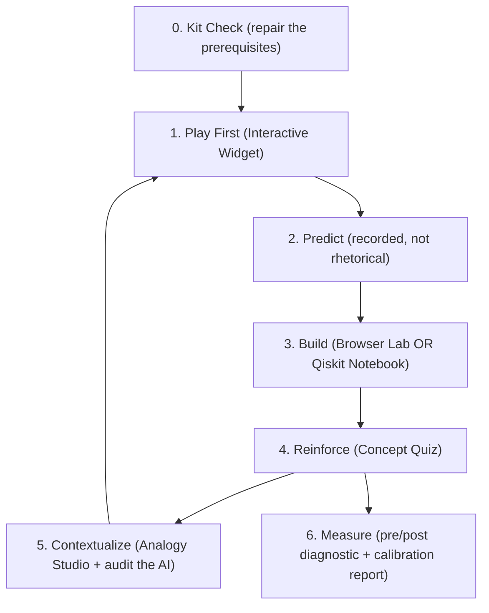

# Educational Methodology

Most quantum computing courses introduce concepts via static presentation slides, list formulas, and then ask students to complete multiple-choice recall quizzes. This methodology fails to build functional development skills and leaves learners feeling overwhelmed.

**Quantum Ascent** implements a student-centric pedagogical loop that ensures deep conceptual understanding and active coding skills — and, crucially, one that **measures whether it worked** rather than assuming it did:

---

```mermaid
graph TD
    K["0. Kit Check (repair the prerequisites)"] --> A
    A["1. Play First (Interactive Widget)"] --> P["2. Predict (recorded, not rhetorical)"]
    P --> B["3. Build (Browser Lab OR Qiskit Notebook)"]
    B --> C["4. Reinforce (Concept Quiz)"]
    C --> D["5. Contextualize (Analogy Studio + audit the AI)"]
    D --> A
    C --> E["6. Measure (pre/post diagnostic + calibration report)"]
```

---

## 1. Play First, Formalize Second (Intuition Sandbox)
* **The Problem:** Abstract mathematical notations (like Dirac braket notation $|\psi\rangle = \alpha|0\rangle + \beta|1\rangle$) create immediate cognitive friction.
* **The Method:** Every basecamp begins with a lightweight, browser-based widget. Before reading formulas, students interact with sliders, buttons, and visual graphs (e.g., tilting a vector on the Bloch sphere and seeing histograms build up).
* **Direct Visual Intuition:** We ground mathematical abstractions into literal visual ratios. For example, rather than an abstract line pointing on a Bloch sphere, the vector stick itself becomes a physical pie chart—divided into exact green/orange color proportions to match the underlying probability amplitudes of the quantum state.
* **The Result:** The student builds a visual, concrete mental model of physical behaviors (e.g., rotation, probability density, and statistical fluctuations) *before* the formal math is introduced. The math then simply names what the student has already seen and controlled.

## 1b. Predict Before You Run (and record it)

* **The Problem:** "Predict what will happen" is the best instruction in science education and
  the most commonly wasted one. Asked rhetorically, it produces a vague half-thought the
  learner immediately overwrites with the answer on screen.
* **The Method:** Every task **gates the work behind an explicit prediction**. You cannot build
  until you have committed to an answer, and that answer is written to a local
  **Prediction Ledger** with the concept it tests.
* **The Result:** At the Summit the learner receives a **calibration report** — first-try
  accuracy, strongest and weakest concepts. This converts our pedagogy from a claim into data,
  and gives the learner a second, rarer skill: knowing when they do not know. A wrong
  prediction is never penalised; committing to one is the entire point.

## 2. Gap-Fill Active Coding — on either of two equivalent tracks
* **The Problem:** Learners often copy-paste entire blocks of code without understanding the underlying mechanics, leading to passive learning.
* **The Method:** We adopt a "gap-fill" programming structure (inspired by QWorld's QNickel). The scaffolding is provided; the student writes the specific mathematical or logical expression.
* **Two tracks, deliberately equivalent.** The **Browser Lab** runs an exact statevector
  simulator written in JavaScript — no install, no account, verified against Qiskit to 1e-12 —
  and writes the equivalent **Qiskit code on screen as the learner clicks**, so browser-track
  students acquire the real syntax passively. The **Notebook** track runs the same tasks
  against real Qiskit in Colab. Both mint the same completion code. This exists because the
  Colab round-trip (five context switches, a 90-second install before anything rewarding
  happens) was our single largest structural drop-off, and no amount of good writing fixes a
  funnel problem.
* **Checkers judge physics, never syntax.** Any circuit producing the required state passes.
* **Three-rung hints instead of an answer key.** On both tracks, "I'm stuck" leads to a nudge,
  then a strategy, then almost-the-answer — never straight to the solution. Asking is never
  recorded or penalised.
* **The Result:** Active recall and problem-solving are triggered. 
* **Statistical Checkers:** Checkers embedded in the notebook run immediately after a student completes a task. For quantum measurements, checkers do not search for exact string matches; they use statistical tests (like Chi-Square goodness-of-fit) to judge if the student's code produces correct distributions, showing learners that quantum sampling fluctuates naturally.

## 3. Personalized Context (The Analogy Studio)
* **The Problem:** Standard pop-science analogies (e.g., "superposition is a coin spinning in mid-air") simplify quantum states to the point of physical inaccuracy, while textbook analogies can be dry.
* **The Method:** The **Analogy Studio** allows students to input their personal hobbies, job, or passions (e.g., cricket, baking, classical music). It then engineers a highly structured prompt for their favorite LLM (ChatGPT, Claude, Gemini).
* **Physical Guardrails:** The prompt bakes in "Ground Rules"—strict physical laws the concept must obey. This forces the LLM to explain the concept through the student's personal world *without* drifting into pop-science myths or compromising scientific accuracy.
* **Closing the loop — the learner audits the AI.** Engineering the prompt only controls the
  question. Students paste the AI's reply back into the Studio, which flags stock myth
  phrasings ("0 and 1 at the same time", "tries every answer at once", faster-than-light
  signalling) and then hands over a checklist of five questions no pattern-match can answer.
  Making the student the auditor of a confident machine is a transferable skill, and the page
  is explicit that a clean scan is *not* a verification of the physics.

## 3b. Myth-Avoidance as a Product, Not a Policy

* **The Problem:** Most introductory material either lies to be friendly ("a qubit is 0 and 1
  at the same time") or hides behind rigour (Dirac notation on page one). The first teaches
  something that must later be unlearned; the second never lets the beginner start.
* **The Method:** The **Myth Autopsy** takes six famous claims and dissects each with a live
  simulation the reader runs themselves — including one where they hold both halves of a Bell
  pair and *try to send a faster-than-light message*, and fail.
* **Every myth ends with a usable replacement sentence.** Correcting someone without giving
  them better words just leaves them repeating the myth with a caveat attached.

## 4. Gamified Loop (Confidence Builders)
* **The Problem:** Self-paced online learning suffers from high drop-out rates due to a lack of immediate reward or visible milestones.
* **The Method:** Quizzes provide immediate, single-question feedback with detailed explanations typeset in LaTeX. Clearing a basecamp quiz triggers confetti, allocates XP points, and awards digital badges stored locally on the learner's device. 
* **The Result:** Progression mapping visualizes the climb up the mountain range, motivating learners to scale basecamps at their own pace.

## 6. Measured, Not Assumed

* **The Problem:** Educational projects almost always argue from design intent. "We built it
  well" is not evidence that anyone learned anything.
* **The Method:** The same ten-question **concept diagnostic** is taken before Basecamp 1 and
  after the Summit. The pre-test deliberately reveals **nothing** — no score, no answers —
  because a revealing pre-test turns itself into a lesson, and the post-test would then be
  measuring the test rather than the course. Several distractors are the popular myths,
  phrased attractively, so we can detect whether those specific beliefs were dislodged.
* **The Result:** A per-learner delta, a concept-by-concept table, and the Prediction Ledger's
  calibration report — exported as a single JSON file with no server and no account. The
  verdict text is honest in both directions: a flat delta says so, and a negative one says the
  confusion may be a bug in our teaching rather than in the learner.

## 7. Honesty as Pedagogy

Every real-world application card carries one sentence about current limits. The capstone uses
graphs where QAOA **visibly falls short** — a frustrated triangle where the best possible
answer still leaves an edge uncut, and a 5-cycle where depth-1 reaches only ratio 0.94 — because
the word *Approximate* has to be paid off. We say plainly that more depth means more gates and
therefore more noise, and that no quantum advantage has been demonstrated for Max-Cut on real
hardware.

This is a pedagogical choice, not a disclaimer. A learner who has seen where an algorithm fails
understands it better than one who has only seen it succeed — and is far more use to the field.
